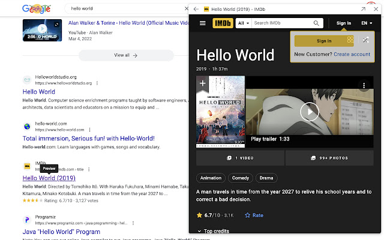

#  Better Previews

A browser extension for previewing links and search results without opening new tabs.



## Downloads

<table cellspacing="0" cellpadding="0">
  <tr>
    <td valign="center">
      <a align="center" href="https://chrome.google.com/webstore/detail/better-previews/mmmfofondapflhgbdidadejnechhjocm">
        
        <p align="center">Chrome Web Store</p>
      </a>
    </td>
    <td valign="center">
      <a href="https://chrome.google.com/webstore/detail/better-previews/mmmfofondapflhgbdidadejnechhjocm">
        
        <p align="center">Firefox Add-ons</p>
      </a>
    </td>
  </tr>
</table>

## Features

- Start search from any website.
- Preview the results of pages on any search engine.
- Drag and resize preview window.
- Go from preview to full tab with one click.
- Navigate forward and backward within a preview.

## Project setup

```bash
# Install dependencies
npm install

# Build extension for development, watch for file changes and rebuild.
node tools/esbuild watch

# Generate compliant images assets for logo (default logo location src/assets/logo.png)
node tools/esbuild generateIcons

# Translate app strings to all supported chrome locales
node tools/esbuild translate

# Start an instance of Chromium with extension installed (using puppeteer)
# For Firefox, pass --browser=firefox as argument.
node tools/esbuild start

# Build and package extension into a store-ready upload
node tools/esbuild --prod

# Create extension package for Firefox/Opera/Edge by specifying --browser argument
node tools/esbuild --prod --browser=firefox

# Run tests
node tools/esbuild test
```

### Install Locally

#### Chrome

1. Open chrome and navigate to extensions page using this URL: chrome://extensions.
2. Enable the "Developer mode".
3. Click "Load unpacked extension" button, browse the `build/chrome-dev` directory and select it.

### Firefox

1. Open firefox and navigate to `about:debugging#/runtime/this-firefox`.
2. Click the "Load Temporary Add-on" button.
3. Browse the `build/firefox-dev` directory and select the `manifest.json` file.

https://support.mozilla.org/en-US/kb/add-on-signing-in-firefox
